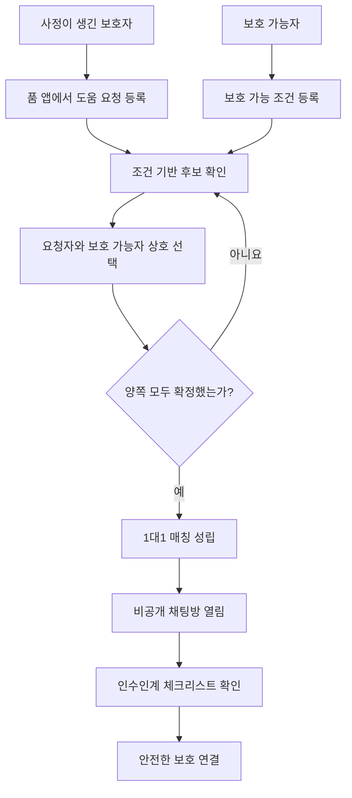
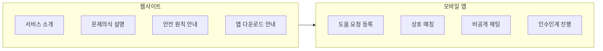
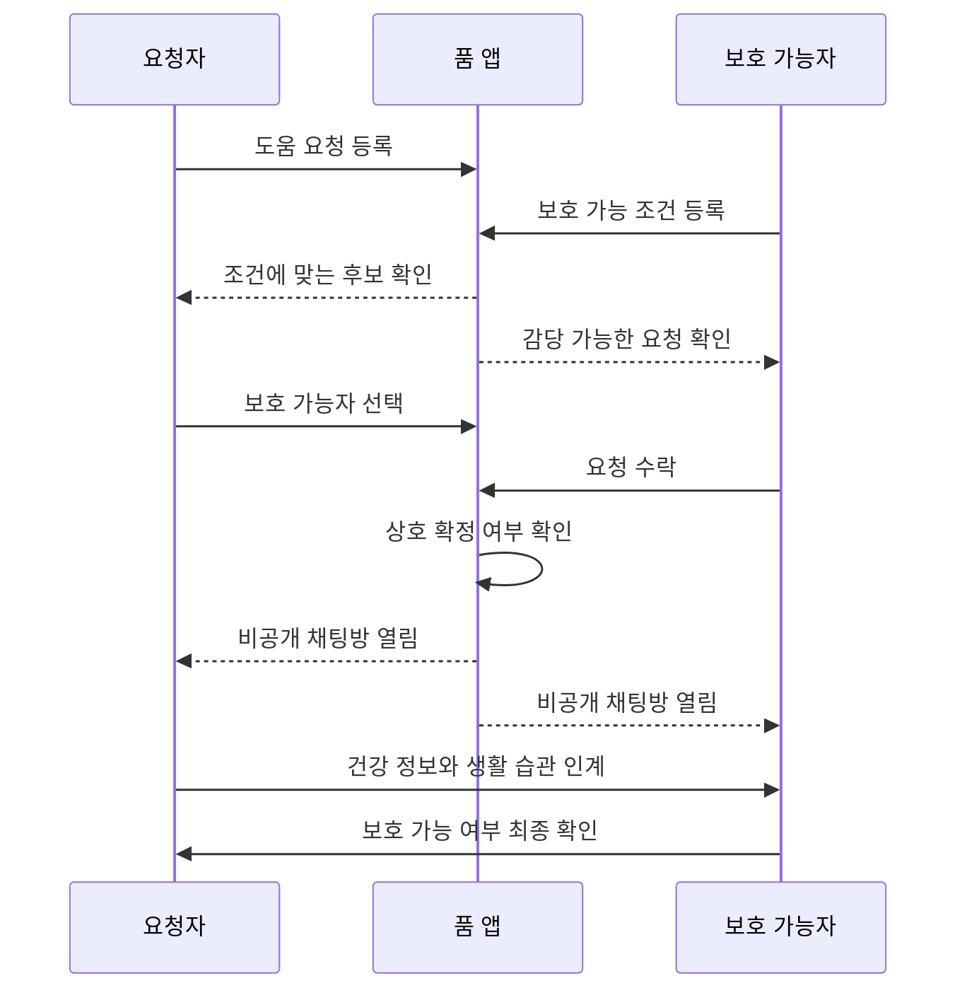
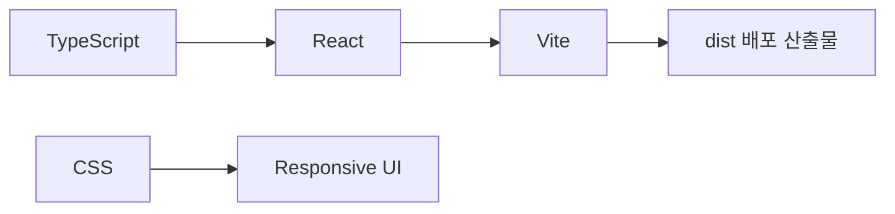
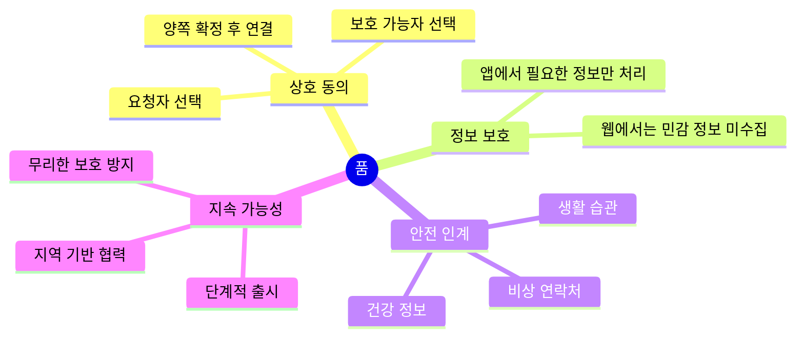

# 품 : 평생의 반려(伴侶)

품은 사정이 생긴 보호자와 도움을 줄 수 있는 사람을 안전하게 연결하기 위한 서비스입니다.

이 저장소는 **품 웹사이트**를 위한 프로젝트입니다. 웹사이트는 직접적인 도움 요청, 개인정보 입력, 채팅을 처리하는 공간이 아니라, 품이 해결하려는 문제와 서비스 원칙, 앱의 역할을 설명하는 소개 페이지입니다.

실제 도움 요청, 상호 매칭, 비공개 채팅, 인수인계는 향후 모바일 앱에서 진행되는 구조를 기준으로 설계했습니다.

## 프로젝트 소개

반려동물을 키우는 과정에서 갑작스러운 이사, 건강 문제, 경제적 어려움, 가족 상황 변화처럼 더 이상 직접 돌보기 어려운 일이 생길 수 있습니다. 이때 보호자가 곧바로 유기라는 마지막 선택으로 몰리지 않도록, 품은 도움을 요청할 수 있는 사람과 보호가 가능한 사람을 안전하게 연결하는 방식을 제안합니다.

품은 감정적인 호소보다 **절차, 확인, 상호 동의, 안전한 인수인계**를 중요하게 생각합니다.

## 웹사이트의 역할

품 웹사이트는 서비스의 방향을 설명하는 공간입니다.

- 품이 해결하려는 문제를 소개합니다.
- 웹과 앱의 역할 차이를 설명합니다.
- 앱에서 이루어질 매칭 흐름을 안내합니다.
- 개인정보와 민감한 대화는 웹에서 다루지 않는다는 원칙을 보여줍니다.
- 앱 출시 전 서비스 방향, 안전 원칙, 협력 가능성을 알립니다.

## 앱의 역할

앱은 실제 실행이 이루어지는 공간입니다.

- 도움 요청 등록
- 보호 가능 조건 등록
- 요청자와 보호 가능자의 상호 선택
- 1대1 매칭 확정
- 매칭 이후 비공개 채팅
- 건강 정보, 생활 습관, 비상 연락처 등 인수인계 체크리스트 관리

## 전체 서비스 구조



## 웹과 앱의 역할 분리



## 핵심 이용 흐름



## 주요 화면 구성

웹사이트는 다음 흐름으로 구성되어 있습니다.

1. 인트로

   품 로고와 `품 : 평생의 반려(伴侶)` 문구가 등장합니다.

2. 메인 소개

   `품은 사정이 생긴 보호자와 도움을 줄 수 있는 사람을 안전하게 연결합니다.`라는 핵심 문장을 중심으로 서비스 방향을 설명합니다.

3. 품이 필요한 이유

   보호자가 처한 상황, 무리한 연결 방지, 인수인계의 빈틈을 설명합니다.

4. 이용 흐름

   상황 정리, 후보 확인, 상호 확정, 앱 채팅, 안전 인계까지의 절차를 안내합니다.

5. 앱 소개

   요청자, 보호 가능자, 협력 기관의 관점에서 앱에서 제공될 기능을 설명합니다.

6. 안전 원칙

   상호 동의, 정보 최소화, 검증 기반, 기록 인계를 핵심 원칙으로 제시합니다.

7. 매칭 전 준비사항

   요청자와 보호 가능자가 연결 전에 준비해야 할 정보를 정리합니다.

8. 출시 계획

   웹 공개, 비공개 테스트, 지역 단위 시작, 정식 출시 흐름을 안내합니다.

9. FAQ

   웹과 앱의 역할, 채팅이 열리는 시점, 운영자의 개입 범위, 인수인계 정보 등을 설명합니다.

10. 앱 다운로드

    앱스토어와 구글 플레이 다운로드 영역을 준비 중인 상태로 안내합니다.

## 디자인 방향

품 웹사이트는 반려동물 사진을 사용하지 않는 방향으로 설계되었습니다.

이 프로젝트는 사진으로 감정을 강하게 자극하기보다, 서비스의 구조와 원칙을 차분하게 전달하는 것을 목표로 합니다. 전체적인 화면은 30대 이상 사용자도 부담 없이 읽을 수 있도록 안정적이고 절제된 색상, 부드러운 애니메이션, 명확한 정보 구조를 중심으로 구성했습니다.

## 주요 디자인 특징

- 품 로고 색상 계열의 초록색 사용
- 과하지 않은 스크롤 페이드 애니메이션
- 자동 전환되는 앱 단계 카드
- 웹과 앱의 역할을 명확히 분리한 설명 구조
- 카드형 정보 배치
- 반응형 레이아웃
- 접근성을 고려한 `prefers-reduced-motion` 대응

## 기술 스택



사용 기술:

- TypeScript
- React
- Vite
- CSS
- Mermaid 문서 다이어그램

## 프로젝트 실행 방법

### 1. 의존성 설치

```bash
npm install
```

### 2. 개발 서버 실행

```bash
npm run dev
```

기본 개발 주소:

```text
http://127.0.0.1:5173/
```

### 3. 배포용 빌드

```bash
npm run build
```

빌드 결과물은 `dist` 폴더에 생성됩니다.

### 4. 빌드 결과 미리보기

```bash
npm run preview
```

## 배포 방법

Vercel, Netlify, Cloudflare Pages, GitHub Pages 같은 정적 호스팅 서비스에 배포할 수 있습니다.

일반적인 설정은 다음과 같습니다.

```text
Build Command: npm run build
Output Directory: dist
```

Vite 설정에서 `base: "./"`를 사용하면 하위 경로에 배포하더라도 JavaScript와 CSS asset 경로가 깨질 가능성을 줄일 수 있습니다.

## 저장소 구조 예시

```text
poom_web
├─ index.html
├─ package.json
├─ package-lock.json
├─ tsconfig.json
├─ vite.config.ts
├─ src
│  ├─ main.tsx
│  ├─ main.ts
│  ├─ styles.css
│  └─ vite-env.d.ts
└─ README.md
```

## 품이 지키려는 원칙



## 향후 개선 아이디어

- 앱 출시 전 사전 신청 폼 연결
- 협력 기관 문의 폼 추가
- 개인정보 처리방침 페이지 추가
- 이용약관 페이지 추가
- 접근성 점검 강화
- 실제 앱 다운로드 링크 연결
- 서비스 운영 지역 안내
- 관리자용 문의 관리 기능

## 프로젝트 한 줄 설명

반려동물을 포기하기 전, 보호자와 도움을 줄 수 있는 사람을 안전하게 연결하는 품 웹사이트입니다.

